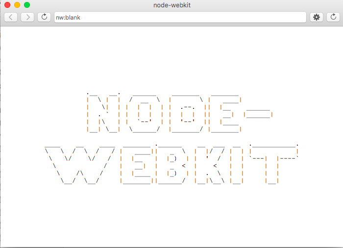
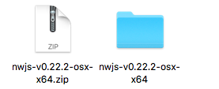
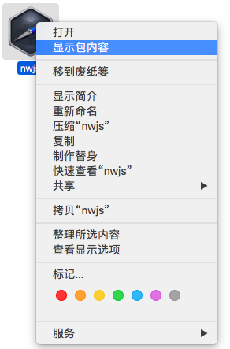

## 		    mac使用debugGap各种不行的解决方案


##### 正常的使用流程我就不多说了，百度一搜一大堆。

##### 首先我们将下好的debugGap打开之后应该会出现下图的问题



##### 首先看到这个会想什么是`node-webkit`？简单暴力点理解就是做桌面应用的

##### 我的思路就是：这个`debugGap`是用`node-webkit`来做的，然后做的时候在mac上出现了点问题

##### 解决这个问题的办法之前我听一个同事说过直接点击文件夹内的一个`nwsnapshot`的执行一下再打开就ok了，但是有的就不行比如我

##### 之后我就开始看`debugGap`到底怎么实现的，其实就是通过`html`+`js`的技术最后用`node-webkit`给搞成了应用程序

> #### 我的解决方案是：

1. ##### 先去官网将`node-webkit`给下载下来  https://nwjs.io/

2. #####  将下载好的给解压了

   

   ##### 压前与压后 

3. ##### 接下来打开文件内的`nwjs`(注意他是个应用)

   

   ##### 就这么打开看到了里面有叫`Contents`的文件夹就ok了

4. ##### 开始设置你的`~/.bash_profile`将以下代码写入并保存

   ```javascript
   alias nw="download/nwjs-v0.22.2-osx-x64/nwjs.app/Contents/MacOS/nwjs"
   ```

   #####  这里的地址就是你刚才打开的那个地址（也可以解压在跟目录下更方便）`source ~/.bash_profile` 使别名立即生效

5. ##### 设置完别名之后在命令行里 执行nw测试一下没问题开始下一步

6. ##### 找到你的`debugGap`打开里面的`package.json`找到main字段，这里就是项目的入口文件，改成`main`文件夹下的`index.html`,这里的main文件就是`debugGap`这个程序的所有代码

7. #####  最后一步回到命令行里执行

   ```javascript
   nw project/DebugGap/
   ```

   ##### 这里的`project/DebugGap`就是你下载的`debugGap`的目录。

   ​


### 大概的意思就是使用node-webkit重新帮我们执行一下修改了之后的debugGap就ok了


